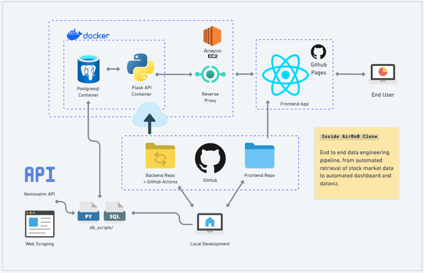
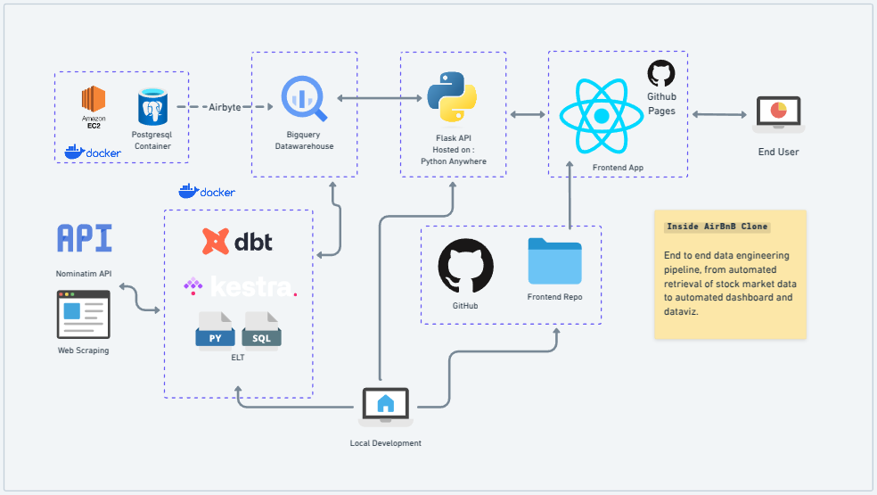

# INSIDE ABNB

Clone of the [Inside Airbnb website](https://insideairbnb.com/paris/) as a single page web application with a few tweaks.

Test it [here](https://caidam.github.io/inside-abnb-front/).

- #### Original Architecture

- #### Updated Architecture

> Updated to a 100% free architecture by moving from EC2 hosting to Python Anywhere for the backend API

- #### Repos

  - [Backend Repo](https://github.com/caidam/inside-abnb-back)
  - [Frontend Repo](https://github.com/caidam/inside-abnb-front)
